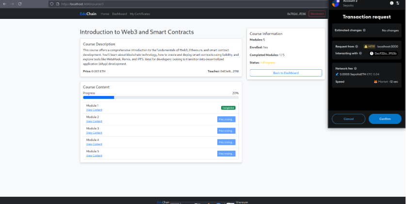

# EduChain — Decentralized E‑Learning on Ethereum

> **Docs‑only repository** with presentation, report, and a high‑level README.  
> Teachers publish courses, students enroll with crypto, progress is tracked on‑chain, and **tamper‑proof certificates** are issued.

---

## Table of Contents
- [Architecture](#architecture)
- [Features](#features)
- [Screenshots](#screenshots)
- [Getting Started](#getting-started)
- [Smart Contracts (Surface)](#smart-contracts-surface)
- [Suggested Repo Layout](#suggested-repo-layout)
- [Authors](#authors)
- [License](#license)

---

## Architecture

<p align="center">
  
</p>

**Stack**  
- **Solidity / Truffle (or Hardhat)** — write, compile, deploy smart contracts  
- **Ganache** — local blockchain for fast tests  
- **MetaMask** — sign transactions from the browser  
- **React + Web3.js/Ethers.js** — decentralized web interface

---

## Features
- **Courses on-chain**: create/update courses (title, description, price, content URL, module count).
- **Trustless enrollment**: payable enrollments; funds go directly to teachers.
- **Progress tracking**: per‑student module completion recorded on‑chain.
- **Verifiable certificates**: issuance recorded on Ethereum; each cert has an immutable ID and metadata.
- **Modern DApp UX**: React frontend + MetaMask; event‑driven feedback.
- **Local + Testnet**: develop on Ganache, deploy to Sepolia for public demos.

---

## Screenshots

<p align="center">
  
  
  
</p>

---

## Getting Started

> This repo currently hosts docs + README. Use the flow below to reproduce a working demo locally.

### Prerequisites
- **Node.js 18+** and npm
- **MetaMask** (browser extension)
- One stack:
  - **Truffle + Ganache**, or
  - **Hardhat**

### Option A — Truffle + Ganache
```bash
npm i -g truffle ganache

mkdir educhain && cd educhain
truffle init

# Add contracts:
# - contracts/EduChain.sol
# - contracts/CourseFactory.sol
# - contracts/CertificateManager.sol
# ...and write migrations/2_deploy_contracts.js

ganache  # in another terminal

truffle compile
truffle migrate --network development
```

### Option B — Hardhat
```bash
npm init -y
npm i --save-dev hardhat @nomicfoundation/hardhat-toolbox
npx hardhat init

# Add contracts, then:
npx hardhat compile
npx hardhat node
npx hardhat run scripts/deploy.js --network localhost
```

### Frontend (React + Ethers)
```bash
npx create-react-app educhain-ui
cd educhain-ui
npm i ethers
# Copy ABI/addresses from your deployment to src/
npm start
```

> Connect MetaMask to your local chain (Ganache/Hardhat). Import a local private key for test funds.

---

## Smart Contracts (Surface)

**Structures**
- `Course { id, teacher, title, description, price, contentUrl, moduleCount, ... }`
- `StudentProgress { isEnrolled, completedModules, completedModuleCount, coursePassed, ... }`
- `Certificate { id, student, courseId, timestamp, issued, metadataUrl, signature }`

**Events**  
`CourseCreated`, `StudentEnrolled`, `ModuleCompleted`, `CourseCompleted`, `CertificateIssued`, `TeacherPaid`, `CourseUpdated`

**Typical functions**
- `createCourse(title, description, priceWei, contentUrl, moduleCount)`
- `enrollInCourse(courseId)` *(payable)*
- `updateProgress(courseId, student, moduleId)` / `markComplete(courseId)`
- `issueCertificate(courseId)`

> Target **Solidity 0.8.x**; leverage **OpenZeppelin** for safety where relevant.

---

## Suggested Repo Layout
```
/contracts            # Solidity sources
/migrations           # Truffle migrations (if using Truffle)
/scripts              # Hardhat deploy scripts (if using Hardhat)
/test                 # Contract tests
/ui                   # React app (optional, separate repo OK)
/docs                 # Project PDFs: presentation + full report + images
  └─ /images          # (these screenshots live here)
```

---

## Authors
- **Daoud ELLAILI**
- **Salah‑eddine ZITOUNI**
- **Hamza SIHAMI**
- **Mohammed EL GUERROUJ**

Academic supervisor: **M. Ali EL KSIMI**

---

## License
Choose a license (MIT/Apache‑2.0). If omitted, all rights reserved.
